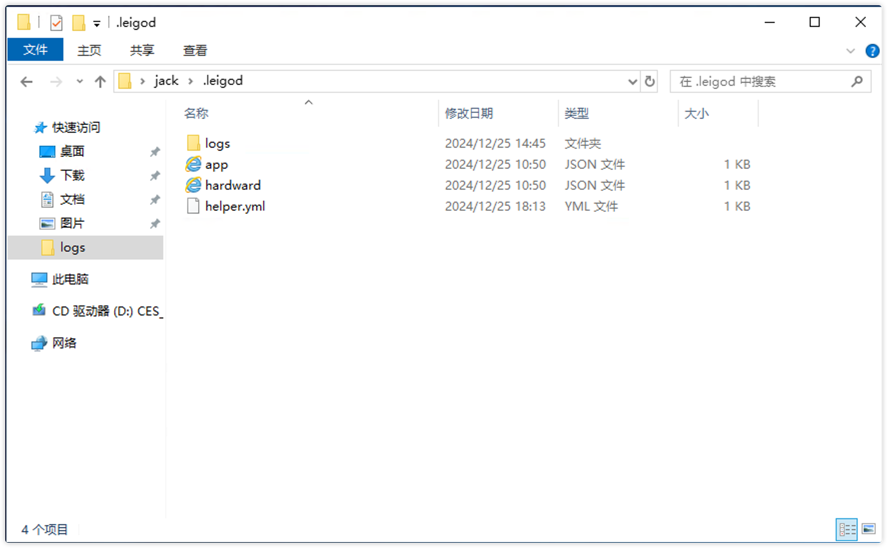

## About
通过webapi暂停雷神加速器加速服务，Windows上融合为关机程序

## 构建
```bash
# Windows可执行程序
make win
ls -l ./build

# 全平台
make all
ls -l ./build
```

## 运行
> 首次运行会要求输入账号密码，自行前往雷神[官网](https://vip.leigod.com/user.html#page=5)设置
> 

### Macos & Linux
> 非Windows平台只停止加速， 不进行关机，可以放到服务器上crontab定时任务
> 

```bash
./leigod-helper
```

### Windows

> 双击`Poweroff.exe`即可关机，关机前自动调用雷神加速器webapi暂停服务
>

## 日志
运行日志位置: `$HOME/.leigod/logs/helper.log`

## 截图

